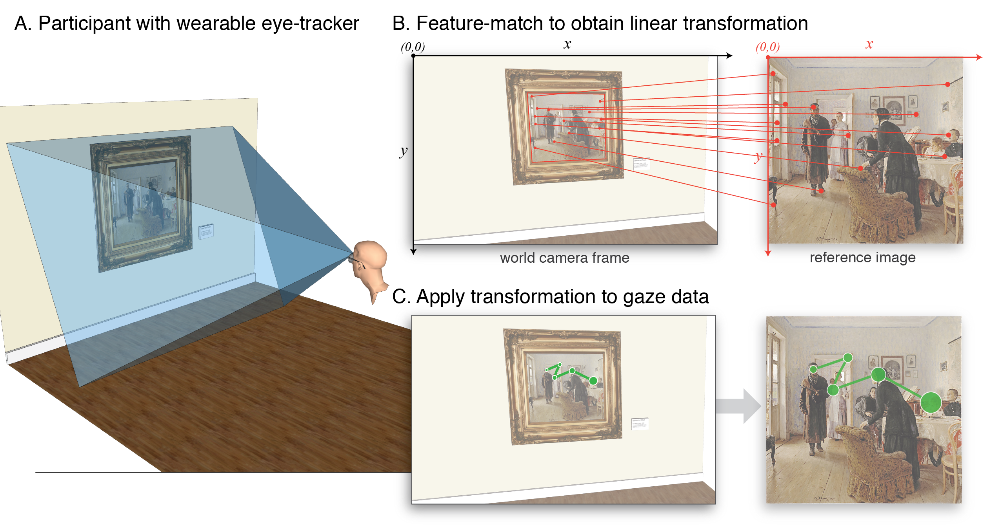

# Mobile Gaze-Mapping

A Python package for mapping mobile gaze data to a fixed target stimulus. 

# Installation
The `mapGaze` tool has been built and tested using `Python 3.6`. To install required dependencies, navigate to the root of this repository and use:

> pip install -r requirements.txt

# Overview

Mobile eye-trackers allow for measures like gaze position to be recorded under naturalistic conditions where an individual is free to move around. Gaze position is typically recorded relative to an outward facing camera attached to the eye-tracker and approximating the point-of-view of the individual wearing the device. As such, gaze position is recorded relative to the individual's position and orientation, which changes as the participant moves. Since gaze position is recorded without any reference to fixed objects in the environment, this poses a challenge for studying how an individual views a particular stimulus over time. 

This toolkit addresses this challenge by automatically identifying the target stimulus on every frame of the recording and mapping the gaze positions to a fixed representation of the stimulus. At the end, gaze positions across the entire recording are expressed in pixel coordinates of the fixed 2D target stimulus. 



# Usage Guide

## Relevant terms:
* **World Camera**: The outward facing video camera attached to the eye-tracking glasses that records the participant's point-of-view. 
* **World Camera Coordinate System**: The 2D coordinate system of each frame from the world camera. Units are pixels and the origin is in the top-left
* **Reference Image**: A high quality, 2D, digital representation of the target stimulus in the environment that the participant is looking at. 
* **Reference Image Coordinate System**: The 2D coordinate system of the reference image. Units are pixels and the origin is in the top-left.

## Input Data

This tool works with mobile eye-tracking data from any manufacturer, provided the raw data has been preprocessed in a way that yields: 

* **Gaze Data File**
Comma or tab separated text file (`.csv` or `.tsv`) that contains the recorded gaze data, with column headings labeled:

	* `timestamp` timestamp (ms) corresponding to each sample
	* `frame_idx` index (0-based) of the worldCameraVid frame corresponding to each sample
	* `confidence` confidence of the validity of each sample (0-1)
	* `norm_pos_x` normalized x position of gaze location (0-1). Normalized with respect to width of worldCameraVid
	* `norm_pos_y` - normalized y position of gaze location (0-1). Normalized with respect to height of worldCameraVid 

	*Example:*

	| timestamp | frame_idx | confidence | norm\_pos\_x | norm\_pos\_y |
	|-----------|-----------|------------|------------|------------|
	| 3941.24   | 0         | 1.0        | 0.5098     | 0.0529     |
	| 3962.13   | 0         | 1.0        | 0.5104     | 0.0533     |
	| 3996.01   | 1         | 1.0        | 0.5117     | 0.0823     |

* **World Camera Video Recording**
 `.mp4` video file representing the world camera recording from the data collection period. 
 
* **Reference Image** 
Image file representing the target stimulus. Preferably med-to-high quality (>1000px on edge), and cropped to only include the stimulus itself. Gaze positions will be mapped to the pixel coordinates of this image. 

### Creating preprocessed input data

To assist in preprocessing your data, this repository includes tools that will preprocess raw data from a select number of mobile eye-tracking devices. You can find them in the `preprocessing` directory. 

* `preprocessing/pl_preprocessing.py`: Built and tested with [Pupil Labs](https://pupil-labs.com/) 120 Hz binocular moble eye-tracking glasses
* `preprocessing/smi_preprocessing.py`: Built and tested with [SMI](https://www.smivision.com/) ETG 2 mobile eye-tracking glasses
* `preprocessing/tobii_preprocessing.py`: Built and tested with [Tobii](https://www.tobii.com/) Pro Glasses 2

Given the ever-evolving way in which different mobile eye-tracking manufacturers record, store, and format raw data, we offer no support for these preprocessing tools, but instead offer them as a starting off point for designing your own customized preprocessing routines. Simply comfirm that your preprocessed data includes the files described above. 

## Running Gaze Mapping

To run the `mapGaze.py` tool, supply the following inputs

```
usage: mapGaze.py [-h] [-o OUTPUTDIR] gazeData worldCameraVid referenceImage

positional arguments:
  gazeData              path to gaze data file
  worldCameraVid        path to world camera video file
  referenceImage        path to reference image file

optional arguments:
  -h, --help            show this help message and exit
  -o OUTPUTDIR, --outputDir OUTPUTDIR
                        output directory [default: create "mappedGazeOutput"
                        dir in same directory as gazeData file]
                        
```

*Example:*
> python mapGaze.py myGazeFile.tsv myWorldCameraVid.mp4 myReferenceImage.jpg

## Output Data
Unless you explicitly supply your own output directory, all of the output will be saved in a new directory named `mappedGazeOutput` found in the same directory that holds the input `gazeData` file. 

The output files include:    

* `world_gaze.mp4`: world camera video with original gaze points overlaid  
* `ref_gaze.mp4`: reference image video with mapped gaze points overlaid
* `ref2world_mapping.mp4`: world camera video with reference image projected and inserted into each frame.
* `gazeData_mapped.tsv`: tab-separated data file with gaze data represented in both coordinate systems - the world camera video, and the reference image 
* `mapGazeLog.log`: Log file 


# Test Data
To test your installation, we have included preprocessed files from a brief 2-second recording, which can be found in the `testData` directory. 

To test, navigate to the directory for this repository, and type:

> python testData/gazeData_world.tsv testData/worldCamera.mp4 testData/referenceImage.jpg

It should take ~1min to complete. Afterwards you will find all of the output files saved in `testData/mappedGazeOutput`:

```
.
└── testData
    ├── gazeData_world.tsv
    ├── mappedGazeOuput
    │   ├── gazeData_mapped.tsv
    │   ├── mapGazeLog.log
    │   ├── ref2world_mapping.m4v
    │   ├── ref_gaze.m4v
    │   ├── testData_referenceImage.jpg
    │   └── world_gaze.m4v
    ├── referenceImage.jpg
    └── worldCamera.mp44
```


